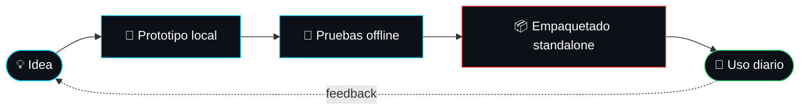

<div align="center">

<!-- ═════════════ CABECERA ═════════════ -->


<a href="https://github.com/IraitzZZ">
  
</a>

<br><br>


<p>
  
  <a href="https://github.com/IraitzZZ?tab=followers"></a>
</p>


<h3>
  <a href="#-pit-board">Pit Board</a> ·
  <a href="#-telemetría">Telemetría</a> ·
  <a href="#-garage">Garage</a> ·
  <a href="#-proyectos">Proyectos</a> ·
  <a href="#-simracing-corner">Simracing</a> ·
  <a href="#-contacto">Contacto</a>
</h3>

</div>

<br>

## 🏎️ Pit Board

<table width="100%">
<tr>
<td width="55%" valign="top">

```yaml
DRIVER:    Iraitz  (SuperIraitz)
TEAM:      Independiente · Pilotando en solitario
BASE:      Euskadi 🇪🇸
ENGINE:    Python · JS · C++ · Bash · PowerShell
FUEL:      Café + ganas de optimizar
TYRES:     Offline-first (cero nube, cero tracking)
STRATEGY:  "Si es repetitivo, lo automatizo.
            Si toca datos privados, corre en local."
STATUS:    🟢 En pista
```

</td>
<td width="45%" valign="top">

**🧭 Mi filosofía**

- ⚡ **Ligero:** software rápido en cualquier PC, sin bloat.
- 🔒 **Privado:** 100% offline, sin nube ni recolección de datos.
- 🤖 **Automático:** si lo hago dos veces, lo convierto en script.
- 🏁 **Iterativo:** como en pista, se mejora vuelta a vuelta.

</td>
</tr>
</table>

<br>

## ⏱️ Telemetría

```text
 SOFTWARE DESKTOP    ▰▰▰▰▰▰▰▰▰▱   90%   GUIs ligeras y rápidas
 IA LOCAL / OFFLINE  ▰▰▰▰▰▰▰▰▱▱   80%   LLMs en tu propio PC
 AUTOMATIZACIÓN      ▰▰▰▰▰▰▰▰▰▰  100%   Bash · Python · PowerShell
 NAS / HOMELAB       ▰▰▰▰▰▰▰▱▱▱   70%   Datos en casa, no en la nube
 SIMRACING           ▰▰▰▰▰▰▰▰▰▰  100%   Aquí no hay límite de potencia
```

<br>

## 🛠️ Garage

<p align="center">
  
</p>

<div align="center">

| 🧩 Sistema | 🔧 Componentes |
| :--- | :--- |
| **Lenguajes** | Python · JavaScript · HTML5 · CSS3 · Bash · PowerShell · C++ |
| **Desktop** | PyQt / PySide · CustomTkinter · scripting nativo del SO · instaladores propios |
| **IA local** | Pipelines LLM offline · automatización de archivos · optimización de sistema |
| **Infra** | Linux · NAS · Docker · Git |

</div>

<br>

## 🚀 Proyectos

Todo lo que construyo encaja en cuatro líneas de producto. Mis repositorios están en [**github.com/IraitzZZ?tab=repositories**](https://github.com/IraitzZZ?tab=repositories).

<table width="100%">
  <tr>
    <td width="50%" valign="top">
      <h3 align="center">🛠️ Utilidades Standalone</h3>
      <p align="center">Apps de escritorio nativas con GUI fluida, ejecución rápida y cero dependencias externas.</p>
      <p align="center">  </p>
    </td>
    <td width="50%" valign="top">
      <h3 align="center">🧠 IA Offline y Privada</h3>
      <p align="center">Modelos de lenguaje y procesado inteligente en el propio equipo: tus datos jamás salen de tu máquina.</p>
      <p align="center">  </p>
    </td>
  </tr>
  <tr>
    <td width="50%" valign="top">
      <h3 align="center">⚡ Automatización</h3>
      <p align="center">Scripts y pipelines que convierten tareas pesadas y repetitivas en un solo clic en segundo plano.</p>
      <p align="center">  </p>
    </td>
    <td width="50%" valign="top">
      <h3 align="center">🖥️ Infraestructura Local</h3>
      <p align="center">NAS, servidores caseros y flujos de datos seguros para una computación privada de verdad.</p>
      <p align="center">  </p>
    </td>
  </tr>
</table>

### 🔁 Cómo trabajo



<br>

## 🏁 Simracing Corner

Código y asfalto virtual comparten lo mismo: **iterar, afinar y buscar la décima**. Me paso las horas entre setups, telemetría y vueltas de clasificación, y ese mismo enfoque lo llevo al software.

<table width="100%">
<tr>
<td width="50%" valign="top">

```text
┌────────────────────────────────────┐
│  🏎️  SIM RIG                       │
├────────────────────────────────────┤
│ Volante .... Direct Drive          │
│ Pedales .... Célula de carga       │
│ Cockpit .... Aluminio rígido       │
│ Pantallas .. Setup inmersivo       │
│ PC ......... Optimizado p/ 144 FPS │
│ Cambio ..... Secuencial + H-shift  │
└────────────────────────────────────┘
```

</td>
<td width="50%" valign="top">

```text
┌────────────────────────────────────┐
│  🎮  PARRILLA DE SIMS              │
├────────────────────────────────────┤
│ 🥇 Assetto Corsa Competizione      │
│ 🥈 iRacing                         │
│ 🥉 Assetto Corsa + mods            │
│ 4º  rFactor 2 / Le Mans Ultimate   │
│ 5º  F1 (para pasar el rato)        │
└────────────────────────────────────┘
```

</td>
</tr>
</table>

<div align="center">

| 🏁 Sector 1 | 🏁 Sector 2 | 🏁 Sector 3 | ⏱️ Objetivo |
| :---: | :---: | :---: | :---: |
| 🟣 Mejor personal | 🟢 Mejorando | 🟡 A pulir | **Bajar otra décima** |

</div>

**🔧 Ideas en el taller, donde el simracing se junta con el código:**

- 📈 Analizador de telemetría offline (ficheros MoTeC / CSV de mis sesiones)
- 🎛️ Gestor local de setups por coche y circuito
- 🔊 Overlay / dashboard propio para segunda pantalla o stream
- ⏱️ Comparador de vueltas con gráficas

<br>

## 📊 Estadísticas

<p align="center">
  
  
</p>

<p align="center">
  
</p>

<p align="center">
  
</p>

<p align="center">
  
</p>

<br>

## 💬 Contacto

> Una **herramienta de IA offline**, una **app de escritorio**, un **script de automatización** o un **servidor privado**:
> si es útil, eficiente y técnicamente sólido, **lo construyo**.

<details>
<summary><b>❓ Preguntas frecuentes</b></summary>
<br>

**¿Trabajas con la nube?** Prefiero soluciones 100% locales. Si el dato es privado, no sale de tu equipo.

**¿Qué tipo de proyectos haces?** Apps de escritorio, IA local, automatizaciones y sistemas NAS / homelab.

**¿Cómo te contacto?** Abre un *issue* o una *discussion* en mis repos, o escríbeme desde mi perfil de GitHub.

</details>

<p align="center">
  <a href="https://github.com/IraitzZZ"></a>
  <a href="https://github.com/IraitzZZ?tab=repositories"></a>
  <a href="https://github.com/IraitzZZ?tab=followers"></a>
</p>

<div align="center">


🏁🏁🏁🏁🏁🏁🏁🏁🏁🏁🏁🏁🏁🏁🏁🏁🏁🏁🏁🏁

*"Buen código resuelve problemas, en silencio y con eficiencia."*
*"Y una buena vuelta, también."* 🏎️

🇪🇸 **Desde Euskadi para el mundo.**


</div>
